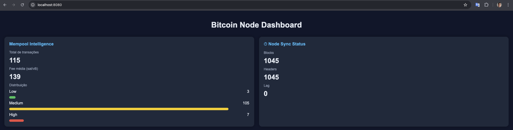
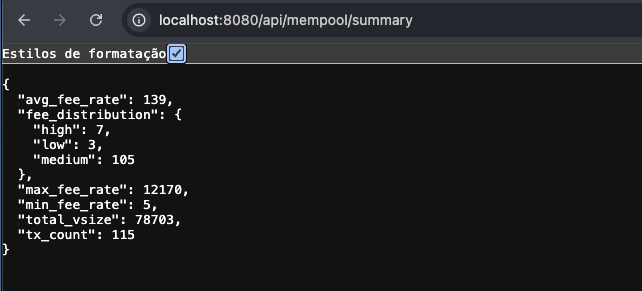
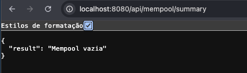
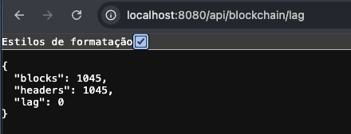

# CoreCoders: Integrando Bitcoin Core com Golang
Este repositório contém os roteiros práticos para a execução das atividades 1 a 3 do Treinamento CoreCoders do Bitcoin Coders. O objetivo é preparar um ambiente de desenvolvimento Bitcoin Core em modo **Regtest**, configurar múltiplos nodes e integrar esses dados utilizando **Golang**.

---

## Preparação do Ambiente
Primeiro, clone o repositório base e acesse a pasta do projeto:
```bash
git clone https://github.com/rxsantos/corecraft
cd corecraft
```

## Isolamento de Diretórios
Para rodar dois nodes no mesmo macOS sem conflitos de dados, criaremos diretórios específicos:
```bash
mkdir -p ~/$HOME/bitcoin_node1
mkdir -p ~/$HOME/bitcoin_node2
```

&nbsp;&nbsp;&nbsp;&nbsp;**Sistema Utilizado:** macOS Tahoe 26.3.1.

&nbsp;&nbsp;&nbsp;&nbsp;**Software:** Bitcoin Core (bitcoind) baixado de [https://bitcoin.org/en/download](https://bitcoin.org/en/download)

# Atividade-1
## Passo 1: Configuração do bitcoin.conf
Crie os arquivos de configuração para que os nodes operem em portas diferentes e com suporte a RPC.

## Node1
**Local:** $HOME/bitcoin_node1/bitcoin.conf

```toml

regtest=1
fallbackfee=0.0001

[regtest]
port=38445
rpcbind=127.0.0.1
rpcallowip=127.0.0.1
rpcport=38443
rpcuser=teste
rpcpassword=teste

zmqpubrawtx=tcp://127.0.0.1:38330
zmqpubrawblock=tcp://127.0.0.1:38331
```

## Node2
**Local:** $HOME/bitcoin_node2/bitcoin.conf

```toml

regtest=1
fallbackfee=0.0001

[regtest]
port=38446
rpcbind=127.0.0.1
rpcallowip=127.0.0.1
rpcport=38444
rpcuser=teste
rpcpassword=teste

zmqpubrawtx=tcp://127.0.0.1:38332
zmqpubrawblock=tcp://127.0.0.1:38333
```

## Passo 2: Execução e Atalhos

# Inicializando os Nodes
Inicie ambos os daemons apontando para seus respectivos diretórios:
```bash
bitcoind -datadir=$HOME/bitcoin_node1 -daemon
bitcoind -datadir=$HOME/bitcoin_node2 -daemon
```

# Configurando Aliases (Atalhos)
Adicione ao seu *~/.zshrc* para facilitar os comandos:
```bash
alias node1='bitcoin-cli -datadir=$HOME/bitcoin_node1/build/bin/bitcoin-cli'
alias node2='bitcoin-cli -datadir=$HOME/bitcoin_node2/build/bin/bitcoin-cli'
```
*Após salvar, execute source ~/.zshrc no terminal.*

## Passo 3: Carteiras e Conectividade
Criar Carteiras e Endereços
```bash
# Node 1 (Minerador)
node1 createwallet "miner"
node1 getnewaddress

# Node 2 (Cliente)
node2 createwallet "cliente"
node2 getnewaddress
```
## Conectar Node 2 ao Node 1
```bash
node2 addnode "127.0.0.1:38445" "onetry"
```
*Verifique com: **node1 getpeerinfo***

## Passo 4: Geração de Blocos e Transações

# Gerar saldo (Mining)
Gere 101 blocos no Node 1 para habilitar o saldo da Coinbase:
```bash
node1 -generate 101
```
# Simular Cenários de Taxas (Fees)
```bash
# Alta Prioridade (100 sats/vB)
node1 -named sendtoaddress address="ENDERECO_NODE_2" amount=10 fee_rate=100 replaceable=true

# Média Prioridade (40 sats/vB)
node1 -named sendtoaddress address="ENDERECO_NODE_2" amount=10 fee_rate=40 replaceable=true

# Baixa Prioridade (5 sats/vB)
node1 -named sendtoaddress address="ENDERECO_NODE_2" amount=10 fee_rate=5 replaceable=true
```

## Passo 5: Configuração Golang
# Instalação
1. Baixe em [https://go.dev/dl/](https://go.dev/dl/)
2. Adicione ao seu *~/.zshrc:*
```bash
export GOPATH=$HOME/go
export PATH=$PATH:/usr/local/go/bin:$GOPATH/bin
```

## Executar Atividades
```bash
# Atividade 1
cd atividade-1 && go run main.go

# Atividade 2
cd atividade-2 && go run main.go

# Atividade 3
cd atividade-3 && go run main.go
```

# Captura de Telas - Atividade 1
## Dashboard - Snapshot Inteligente Mempool e Blockchain

## API - Snapshot Inteligente - Mempool

## API - Snapshot Inteligente - Mempool Vazia

## API - Snapshot Inteligente - Blockchain
